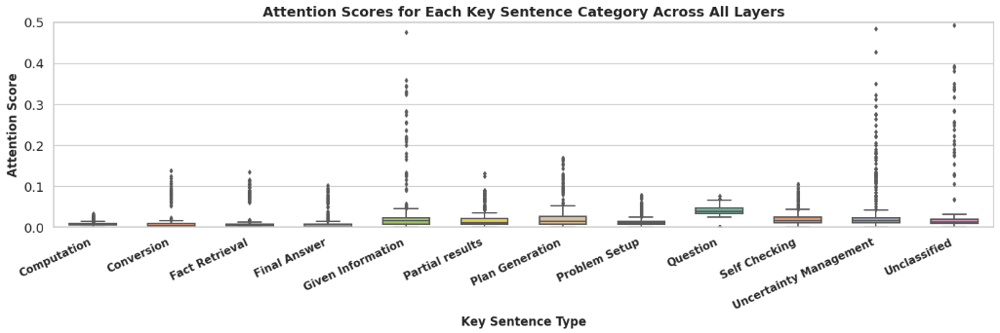
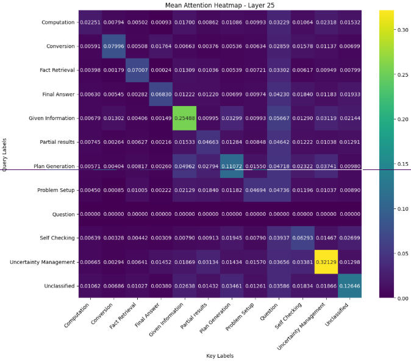
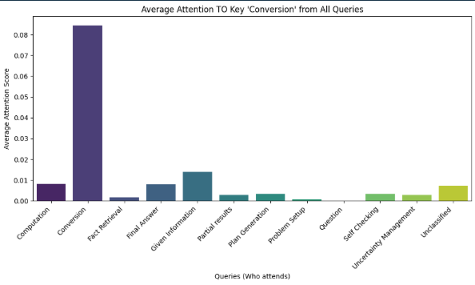
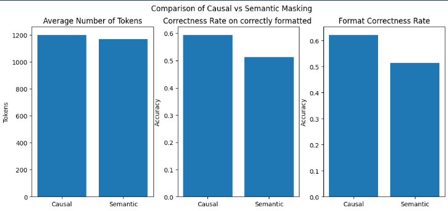
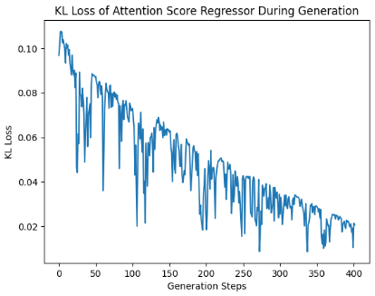
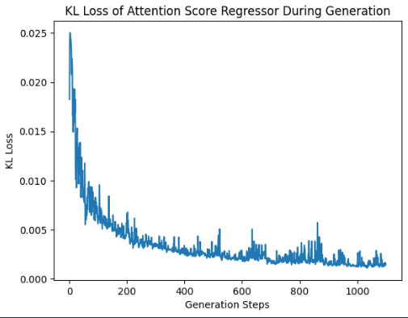

# Attention Analysis in Reasoning LLMs

## Introduction

By efficient reasoning, we generally refer to reducing the length of the thinking process before providing the final answer, while maintaining the correctness of the answer.
There are plenty of methods targeting different aspects, among which we mention:

- **RL methods**: Use a length-based reward model.
- **SFT methods**: Train the LLM on variable-length (shorter) answer samples.
- **Latent representation methods**: Compress long CoT (thinking) tokens into more compact latent representations.
- **Prompt-guided reasoning**: Craft precise prompts to achieve shorter thinking steps.
- **Attention-related methods**: Optimize KV caching or apply KV compression.

In our work, we focus exclusively on attention mechanism-related methods. We conduct an extensive analysis of attention behavior during the thinking process.

This repository contains code and analysis for studying attention mechanisms in large language models during mathematical reasoning tasks. We investigate how attention patterns change in Llama models when solving GSM8K math problems. The project implements:

- A self-attention regression model for predicting attention scores, used for probing.
- A custom masking strategy called **"semantic-causal"**.
- Reasoning decomposition into semantic categories.
- Analysis of attention flows between reasoning components.

---

## Attention Pattern Analysis

Because of KV caching, at each decoding step $t$, the model only needs to compute the attention between the new token and all previous tokens. At the end of generation for each single answer, we obtain an attention matrix:

$$\mathcal{A} \in \mathbb{R}^{N \times L \times H \times 1 \times T}$$

where:
- $N$ = number of generations (answer tokens)
- $L$ = number of transformer layers (e.g., $L = 32$ in Llama)
- $H$ = number of attention heads per layer (e.g., $H = 32$)
- $1$ = batch size (single answer per run)
- $T$ = total number of tokens (prompt + generated tokens)

For efficiency, we take the maximum attention score across the heads dimension, yielding:

$$\mathcal{B} \in \mathbb{R}^{N \times L \times 1 \times T}$$

Across different samples, the average or maximum is then calculated for every sentence category.

**Key findings from the box plots:**

- **Computation** sentences are the least attended key sentence category among all categories.
- **Given Information** and **Uncertainty Management** categories have large outlier attention scores. In this case, we need further analysis to explain this large variance.
- The **Question** category is the most attended, which is expected as it provides the main context.

### Reasoning Categories

We generated sample answers with enforced formatting: each answer must contain a thinking block (`<think> ... </think>`) and a boxed final answer (for easier processing); malformed answers were filtered out.

The prompt and thinking process were decomposed into 12 categories, following a similar approach to prior work on thought anchors in LLM reasoning:

| Category | Description |
|---|---|
| Problem Setup | Framing and restating the problem |
| Given Information | Facts stated in the prompt |
| Plan Generation | Steps or strategy outlined before solving |
| Fact Retrieval | Recalled knowledge not in the prompt |
| Conversion | Unit or format transformations |
| Computation | Arithmetic or algebraic steps |
| Self Checking | Verification of intermediate steps |
| Uncertainty Management | Hedging or expressing doubt |
| Partial Results | Intermediate conclusions |
| Final Answer | The concluding answer |
| Unclassified | Tokens not fitting other categories |

> **Note:** Classification was carried out using code rather than LLMs.

Analyzing attention scores across these categories revealed a correlation between the current reasoning phase and attention scores.

---

## Custom KV-Cache Generation Pipeline

Our codebase implements a custom Key-Value caching pipeline for efficient LLM text generation, optimized for attention analysis and reasoning tasks.

- Manages dynamic KV cache using `transformers.DynamicCache`
- Enables semantic custom cache reduction for memory optimization

---

## Semantic Masking

We found that reasoning phases can be decomposed into distinct semantic categories. Unlike default causal masking — which only prevents attending to future tokens — **semantic masking** further modifies attention patterns based on token semantic categories during generation.

We use a token-based logic to categorize tokens into predefined reasoning phases and apply different attention constraints based on these categories (zeroing out or amplifying attention).

### How it works

1. **Token Classification**: Each generated token is assigned a semantic category.
2. **Mask Generation**: Attention masks are created to control which tokens can attend to which others, based on semantic correlations found in our analysis.
3. **Attention Modification**: The attention mechanism is modified to respect semantic boundaries while maintaining causal constraints.
4. **Dynamic Updates**: Masks are updated as new tokens are generated and categorized.

### Why

- To better study the relationship between different reasoning steps and its impact on final results.
- To reduce attention to irrelevant contexts.

Semantic masking allowed us to further investigate the correlation between different reasoning steps and its impact on final results. As an example, given the current generation category — e.g., if we are generating a "Problem Setup" sentence — we mask out all tokens belonging to the "Computation" category.

Surprisingly, we still obtain correct responses under this masking scheme, although with a larger number of output tokens.

---

## Does the "Wait" matter
In reasoning, 'wait' usually defines the phase uncertainty management where the model revise its previous generation. To verify its importance in the correctness of the final answer, we have crafted 10 samples with an arbitrary wrong reasoning step, then injected the magical 'wait'. Surprisingly, the LLM corrected itself in all the samples.  

## Custom Llama Model

### 1. Attention Regressor Integration

- Added an `AttentionRegression` neural network class for predicting attention scores.
- Integrated the regressor into attention layers.
- The regressor uses 28-dimensional input features including token types and positional information.

### 2. Enhanced Attention Mechanism

- Modified the attention forward pass to compute regressor features from token types and positions.
- Features include one-hot encoded token categories and positional embeddings.
- The regressor predicts attention weights to override the standard attention computation during training.

### 3. Semantic-Aware Attention

- Added support for tracking semantic categories.
- Token types are mapped to numerical indices for feature computation.
- Attention weights can be modified based on semantic relationships between tokens.

### 4. Training Mode Support

- Added an `Inference_attention_training` flag to control regressor usage.
- When enabled, attention weights are predicted by the regressor instead of being computed normally.
- Supports both training (regressor updates) and inference (regressor prediction) modes.

### 5. LlamaSdpaAttention Modifications

- Extended SDPA attention to handle semantic token types.
- Falls back to a manual attention implementation when `output_attentions` is required.
- Maintains compatibility with standard Transformers attention while adding custom features.

## Can we replace Key value pairs with semantic features
To investigate the correlation between different reasoning phases at the self-attention level, we experimented with replacing the standard self-attention mechanism (which relies on key–value pairs) with a **28-feature vector representation**.

This vector encodes:

- **Query token type**
- **Query token position** (relative to the generation step)
- **Key token type**
- **Key token position**

Token types are represented using **one-hot encoding**.

We first applied this modification to **a single attention head within one layer** and trained a regression model using **KL-divergence loss**.

Interestingly, the behavior changes significantly during training.

### KL Divergence at the Beginning of Training

### KL Divergence at Later Training Steps

## Future Work

As future work, we plan to further explore replacing the standard self-attention mechanism with **feature-engineered representations**. In particular, we aim to investigate the use of **Semantic features** to model relations between tokens, rather than relying solely on the traditional key–value self-attention.

This direction may help reveal whether attention patterns can be approximated or explained through structured features that capture **token roles, reasoning phases, or semantic relationships** during generation.
